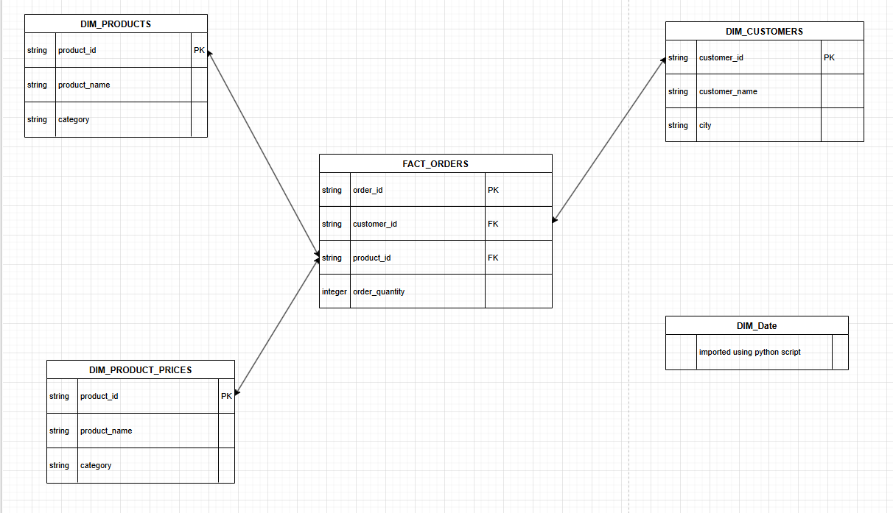
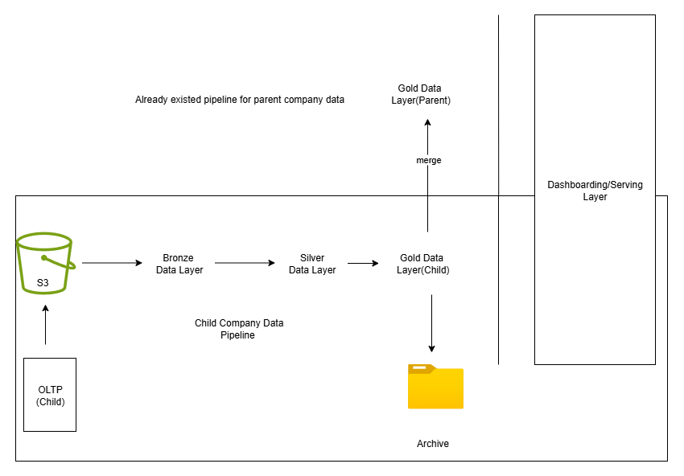

# Databricks Data Engineering Project - Atlikon and SportsBar Orders Pipeline

## 📌 Overview
End-to-end pipeline ingesting raw CSV order data from AWS S3 into 
a Delta Lake medallion architecture (Bronze → Silver → Gold) using 
PySpark on Databricks.

Atliqon is parent company which sells sports equipments and has recently acquired 
Sportsbar Gmbh which sells sports nutrition items. The child company sales data is not 
in the matching format, reporting cycles are indifferent and some data is non existent.
The child company does not have a data engineering and a OLAP system. In order to unify 
supply chain, forecasting  and inventory planning, data of both the companies need to be
consistent and metrics needs to be matched. A unified data layer with consistent data 
from both companies needs to be made to drive business decisions. 



## 🛠️ Tech Stack
- Databricks (PySpark, Delta Lake)
- AWS S3 (external storage)
- Unity Catalog (data governance)
- GitHub (version control)


## 🏗️ Architecture
**S3 Landing → Bronze → Silver → Gold**
(this corresponds to child company data)
- **Bronze**: raw ingested data  
- **Silver**: cleaned and standardized data  
- **Gold**: aggregated, business-ready datasets
- **Merge with Gold Layer of Parent company data**: atlikon and sportsbar data is merged.


## 📂 Project Structure

```
databricks-project/
├── README.md
├── consolidate_pipeline/
│   ├── Setup/
│   │   ├── Setupcatalogs.ipynb
│   │   ├── dim_data_table_creation.ipynb
│   │   ├── utilities.ipynb
│   ├── Dimension Data Processing/
│   │   ├── customer_data_processing.ipynb
│   │   ├── product_data_processing.ipynb
│   │   ├── pricing_data_processing.ipynb
│   ├── Fact Data Processing/
│   │   ├── full_load_fact.ipynb
│   │   ├── incremental_load_fact.ipynb
└── data_architecture.png
```



## How to run
Initially start with setting up gold layer for parent company data, setting up pipelines for both
parent company and child company is beyond the scope of this project, hence we assume the parent 
company already has it established. Therefore directly move onto the gold layer for parent company. 
To start initially run setup_catalogs.ipynb script, this will setup the layers. 
Then load the parent company data directly to gold layer using databricks UI. 
Parent company data corresponds to dim_customers.csv, dim_products.csv, dim_gross_price.csv, 
fact_orders.csv and for the date table, directly run dim_date_table_creation.ipynb. This will
create date table in gold layer. This makes parent company data ready. 

Ingest child company data (full load) into S3 storage. Make a connection from databricks to S3.
Run utilities.ipynb(configuration file), this will setup gold,silver, and bronze schema. 
Run customer_data_processing.ipynb. This will perform some transformation before finally loading up
customer data(child company) into bronze, silver and finally to gold layer. 
In similar fashion run 2_products_data_processing.ipynb and 3_pricing_data_processing.ipynb
At this point child company data is loaded in all the layers and  is merged with parent company data.

To start with fact data processing, make folders landing and processed in S3 bucket and upload data
(full load) to landing folder. The idea is to process these files and once processed move them 
to processed folder. 
Run 01_full_load_fact.ipynb
Staging tables are also made to process incremental/daily data. Later these tables are dropped once the
daily data is processed. Assumption here is OLTP system directly drops the order data daily. 
Run 2_incremental_load_fact.ipynb after uploading incremental load data in S3 loading bucket. This will append
the data into already existing child company data tables along with inserting into staging tables. 

A pipeline can be made directly from databricks UI and triggerd as per business requirement. 

## Note
Initially, dim_customers,dim_date,dim_gross_price,fact_orders, dim_products in GOLD layer is atlikon(parent company) 
data tables. Later, child company data is merged in these tables. 
sb_dim_customers,sb_dim_gross_price,sb_dim_products,sb_orders in GOLD layer is sportsbargmbh(child company)
data tables. 
